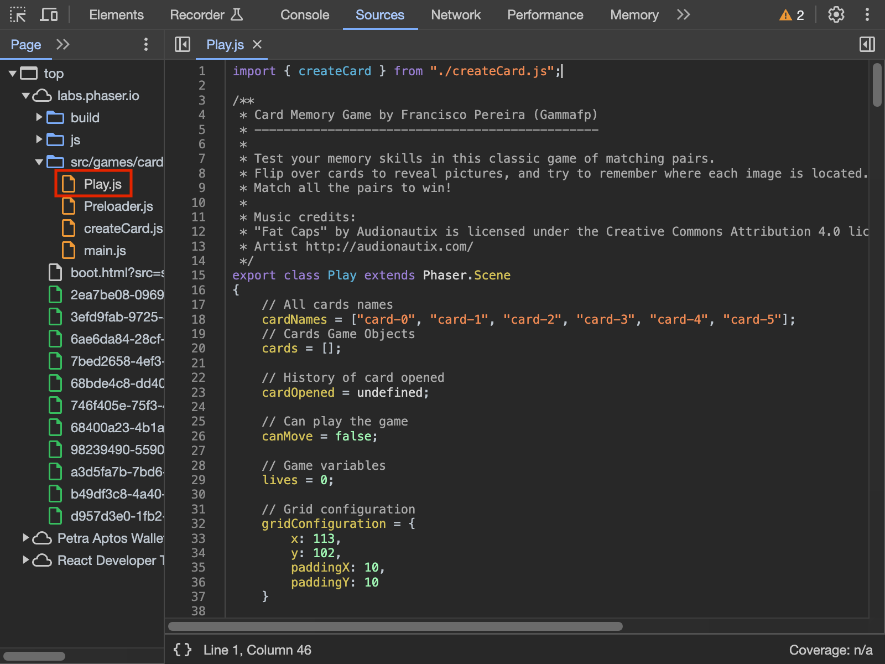

</pre>

안녕하세요 감자입니다. 우리가 매일 사용하는 웹 환경에서 데이터를 조작하는게 가능할까요? 게임에서 치트를 사용하는 것처럼 웹상의 데이터를 조작해보고 싶으신 적이 있을지도 모르겠습니다. 물론 웹 환경에서 데이터를 조작하는 것은 매우 위험한 행위이며, 이러한 행위는 법적으로도 문제가 될 수 있습니다. 하지만, 우리가 사용하는 웹 환경에서는 어떤식으로 데이터가 조작되는지 알아보고 숙지해두는 것도 웹을 올바르게 사용하는데 있어서 중요한 부분이라고 생각합니다. 이런 학술적인 목적으로 오늘은 웹 해킹과 데이터 조작에 대한 주제를 다뤄 보는 시간을 갖도록 하겠습니다.

> 아래 내용은 웹 사용의 이해를 증진하기 위한 목적으로 작성된 글로, 해킹을 권장하는 글이 아닙니다. 이 글을 통해 어떠한 불이익을 초래할 경우, 책임은 해당 당사자에게 있다는 것을 주의해 주십시오.

## 목표

Phaser3 엔진을 기반으로 만들어진 [Card Memory](https://labs.phaser.io/boot.html?src=src\games\card%20memory\boot.json)와 [Vampire Survivors Deomo](https://poncle.itch.io/vampire-survivors) 데이터가 웹 환경에서 어떻게 조작될 수 있는지 살펴보도록 하겠습니다.

## 기술적 배경

웹 게임 해킹에 대해 알아볼 때, "Card Memory"와 같은 자바스크립트 기반 웹 게임의 경우 몇 가지 중요한 특징이 있습니다. 이러한 게임들은 자바스크립트 코드를 통해 실행되므로, 게임 코드를 수정하면 게임이 새로운 스크립트에 따라 작동하게 됩니다. 이는 전통적인 게임 해킹과도 매우 유사합니다 . 대부분의 게임들은 바이너리 형태로 컴파일되어 있어 해킹을 위해서는 특별한 도구가 필요하지만, 웹 게임은 컴파일 과정 없이 자바스크립트 인터프리터를 사용하여 작동합니다. 이러한 차이로 인해 웹 게임은 기존 게임들에 비해 해킹이 상대적으로 간단하다고 볼수있습니다.

## 개발자 도구 활용

해킹을 하기위해서는 일단 해당 목표의 코드를 볼수 있어야합니다. 이러한 점에서 웹 게임에서는 개발자 도구가 매우 유용합니다. Source 탭을 사용하면 모든 자바스크립트, HTML, CSS 파일에 접근할 수 있습니다. 우리의 현재 목표는 게임 로직을 포함한 자바스크립트 파일을 찾아 살펴 보는 것입니다.

우리가 원하는 코드는 위의 이미지에서 볼수 있듯 Play.js 파일에 담겨있습니다. 보통 자바스크립트 코드는 webpack이나 vite같은 모듈 번들러를 써서 최적화 및 경량화(Minification)를 시켜서 사람이 알아보기 힘든 형태로 존재합니다. 하지만, 이 게임의 경우는 Phaser3가 공식적으로 예제로 사용하는 코드이므로 가독성이 좋은 원본코드를 그대로 올려놓은 것 같습니다. 이제 해당 코드를 살펴보겠습니다.

## 코드 조작

게임을 해킹 해서 원하는 결과를 얻는 방법은 다양합니다. 캐릭터의 능력치를 조작 한다거나 게임의 승리 조건을 조작하는 등 여러 방법이 있습니다. 저희는 Card Memory 게임의 목숨이 줄어 들지 않게하여 게임에서 절대 패하지 않는 조작을 해보겠습니다.

위의 그림가 같이 카드를 뒤집었을때 짝이 맞지 않으면 목숨이 줄어드는 로직을 발견할수 있습니다. 사실 자신이 원하는 로직을 찾기란 쉽지 않습니다. 우리가 살펴보고 있는 예제는 게임의 로직이 매우 간단하고, 코드도 직관적이기 때문에 쉽게 원하는 로직을 찾을수 있었습니다.

저는 위와 같이 남은 목숨을 감소시키는 로직을 아예 삭제 해버렸습니다. 이 상태로 코드를 저장하고 게임을 플레이 해보겠습니다. 그러면 다음과 같이 목숨이 줄어들지 않고 게임을 계속 플레이 할수 있습니다.

이렇게 게임의 로직을 조작하여 원하는 결과를 얻을수 있습니다. 이번에는 게임 로직과는 상관없지만 저는 밋밋한 게임의 배경색이 마음에 들지 않습니다. 한번 main.js 파일을 수정해서 배경색을 바꿔보겠습니다.

아까처럼 코드를 수정하고 저장하였지만 게임의 배경색이 변하지 않는걸 볼수있습니다. 왜그런걸까요? 우선 main.js 파일이 어떻게 로드되는지 살펴보겠습니다. main.js 파일은 boot.js 파일에서 script태그로 생성되어 `document.body.appendChild(mainModule);` 형태로 로드되고 있습니다. 한가지 주의해야 할점은 mainModule의 type이 **module**로 설정되어 있다는 것입니다. 일반적인 스크립트에서는 런타임에 코드를 변경하거나 동적으로 스크립트를 추가하는 것이 가능합니다. 하지만 ES6 모듈에서는 모듈의 최상위 수준에서 정의된 코드는 '불변'으로 취급되어, 일단 로드되고 나면 수정할 수 없게 됩니다. 이는 브라우저가 모듈의 의존성을 해석하고, 모듈 간의 관계를 설정을 보장하기 위한 조치입니다.

그렇다면 어떻게 해야할까요? 모든일이란건 한번에 해결되지 않기 마련이죠. 하번 다른방식으로 게임 해킹을 시도해봅시다.
일단 상황을 분석해보자면, 우리는 main.js 파일을 수정하고 싶은데, main.js 파일은 모듈로 로드되어 있어서 수정이 불가능합니다. 그렇다면 한번 이럴때는 main.js 파일을 로드하는 boot.js 파일을 수정해봅시다. boot.js 파일을 수정하여 main.js 파일을 로드하는 script 태그의 type을 module에서 text/javascript로 변경하여 main.js 파일을 로드하도록 해보겠습니다.

아쉽게도 import, export 구문은 애초에 module 형식에서만 사용할수 있기 때문에 main.js 파일을 로드하더라도 코드가 실행되지 않습니다. 그렇다면 main.js가 로드되기전에, 즉 네트워크에서 전달받는 main.js 자체를 수정해보는건 어떨까요?

## 웹 프록시 활용

브라우저가 main.js를 포함한 모든 리소스를 다운로드 받을때, CDN을 통해서 받게됩니다. 브라우저는 리소스들을 받으면 자바스크립트 엔진이 그순간 해당 파일을 실행해 사용자들이 사용하는 웹 화면과 로직들을 활성하 시키게 됩니다. 기본적으로 브라우저는 HTML 파일을 먼저 분석하여 실행하며, 그 과정준 script 태그를 만나면 분석을 중단하고 그 자바스크립트를 외부에 요청해서 받아와 실행시킵니다. 우리의 경우 HTML자체에 main.js를 로드하는 구문은 없고 boot.js 파일에서 main.js를 로드하는 구문이 있습니다.

그럼 우리가 원하는 main.js가 어떻게 CDN을 통해 브라우저에 전달되는지 살펴보겠습니다. 브라우저의 개발자 도구를 열고 Network 탭을 열어놓고 게임을 실행해보겠습니다.

한번 위의 주소로 접속하면 실제 raw javascript 파일을 볼수있습니다. 우리는 main.js가 어디서 전송되는지 알아 냈습니다! 그렇다면 어떻게 CDN으로 부터 전송되는 main.js를 수정할수 있을까요? 이때 프록시 툴을 사용하면 매우 편리합니다. 프록시 툴은 클라이언트와 서버 사이에서 중계기로서 대리로 통신을 수행하는 기능을 합니다. 이를 사용하면 클라이언트와 서버 사이에서 통신을 가로채서 원하는 데이터를 수정하거나, 원하는 데이터를 주입할수 있습니다. 저는 [Burp Suite](https://portswigger.net/burp)라는 웹 프록시를 사용하였습니다.
