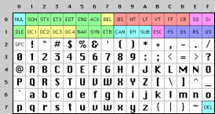
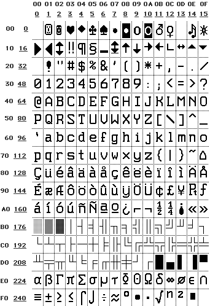

</pre>

안녕하세요 감자입니다. 인터넷이나 컴퓨터를 사용하면서 이상한 글자를 볼 때가 한번쯤은 있을 겁니다 [(예시)](https://docs.oracle.com/cd/E19142-01/819-1066/About.html). 이런 글자들은 대부분 인코딩 문제로 인해 발생합니다. 저도 최근 윈도우 게임서버를 리눅스로 포팅하는 하면서 이러한 인코딩 문제를 많이 겪었습니다. 그래서 이번에는 공부하고 경험한 문자열 인코딩에 대해 정리 하는 시간을 가져보려고 합니다.

## 인코딩의 역사

컴퓨터는 0과 1로 이루어진 비트로 데이터를 저장합니다. 이 비트들을 어떻게 해석하느냐에 따라서 문자열이나 이미지, 동영상 등 다양한 데이터를 저장할 수 있습니다. 이러한 해석 방식을 인코딩이라고 합니다. 문자도 마찬가지로 비트를 어떻게 해석하느냐에 따라서 다양한 인코딩 방식이 존재합니다. 이러한 인코딩 방식은 시간이 지남에 따라서 발전해왔습니다.

### ASCII

처음으로 소개할 인코딩 방식은 ASCII(American Standard Code for Information Interchange)입니다. ASCII는 7비트로 이루어져 있으며, 128개의 문자를 표현할 수 있습니다. 이 128개의 문자는 악센트가 없는 영어 알파벳, 숫자, 특수문자 등이 포함되어 있습니다. ASCII 32에서 127 사이의 숫자를 사용하여 모든 알파벳을 나타낼 수있었습니다. 스페이스는 32이고 문자 "A"는 65 등입니다. 32미만의 코드들은 제어문자로 사용되었습니다. 예를 들어, 10은 줄바꿈을 의미하고 8은 백스페이스를 의미합니다. 문자열을 재밌게도 7과 같이 컴퓨터의 경고음을 만드는 장치 제어문자들도 존재합니다. 하지만 ASCII는 영어 알파벳만을 표현할 수 있기 때문에, 다른 언어를 표현하기에는 부족한 면이 있습니다. ASCII가 만들어질 당시에는 영어권 국가들이 컴퓨터를 사용하는데 있어서 주도적인 역할을 했기 때문에, 이러한 한계는 크게 문제가 되지 않았습니다.



하지만 사람들은 더 많은 문자를 표현하고 싶어했고, 128-255 공간을 자신들의 목적에 맞게 사용하기 시작 했습니다. IBM-PC는 유럽 언어에 대한 악센트 부호가있는 문자를 제공하는 OEM 문자 집합(character set)을 사용했고 가로 막대, 세로 막대등 여러가지 특수문자를 포함해 사용자 화면에 박스와 선을 만들어 낼수 있었습니다.
하지만, 점점 컴퓨터를 서구권이외의 국가에서도 사용하게 되었고 그 수 만큼 OEM 문자 집합이 생겨났습니다. 에를 들어 일부 PC에서는 문자 코드 130이 é로 표시되지만
이스라엘에서 판매 된 컴퓨터에서는 히브리어 문자 Gimel이었습니다 (ג). 그래서 미국인들이 이력서를 이스라엘로 보낼 경우 그들의 이력서는 다음과 같이 제대로 표시되지 않았을 겁니다 (rגsumגs).

### ANSI



결국이 OEM은 ANSI 표준으로 체계화되었습니다. ANSI 표준에서는 128 이하에서 무엇을 해야 하는지에 대해 모든 사람이 ASCII와 거의 동일하도록 동의했지만, 거주 지역에 따라 128 이상의 문자를 처리하는 방법은 각자 처리하게 되었습니다. 이 처리방법은 [코드 페이지(code page)](http://www.i18nguy.com/unicode/codepages.html#msftdos)라 불립니다. 코드페이지의 예제로는, 이스라엘에서 DOS는 862라는 코드 페이지를 사용했으며 그리스 사용자는 737을 사용했습니다. MS-DOS의 국가 버전에는 영어에서 아이슬란드어까지 모든 것을 처리하는 수십 개의 코드 페이지가 있으며 에스페란토와 갈리시아어를 포함하는 "다국어" 코드 페이지도있었습니다. 그래서 따로 프로그램을 만들지 않는다면 히브리어와 그리스어를 같은 컴퓨터에서 얻는 것은 불가능했습니다. 왜냐하면 히브리어와 그리스어는 서로 다른 코드 페이지가 필요하기 때문입니다.

한편, 아시아에서는 아시아 알파벳에 수천 개의 문자가 포함되어 있어 결코 8비트에 맞지 않는다는 사실을 고려하여 훨씬 더 재밌는 일이 벌어지고 있었습니다. 이 문제는 일반적으로 일부 문자가 1바이트에 저장되고 다른 문자는 2바이트로 저장되는 "2바이트 문자 집합"인 DBCS라는 시스템에 의해 해결되었습니다.

하지만 여전히, 대부분의 사람들은 바이트가 문자이고 8비트인로 여겼습니다. 그리고 파일을 다른 컴퓨터로 옮기거나 한 컴퓨터에서 2가지 이상의 언어를 쓰지 않는 이상 이러한 시스템은 잘 작동하는것 처럼 보였습니다. 물론, 인터넷이 생기자마자 위의 가정은 무용지물이 되어 버렸고 더욱 체계화된 인코딩 방식이 필요해졌습니다.

### Unicode

유니코드는 전 세계의 모든 문자를 컴퓨터에서 일관되게 표현하고 사용하기 위한 표준입니다. 이는 다양한 언어와 기호를 단일 문자 집합 내에서 인코딩하고 처리할 수 있도록 설계되었습니다.

지금까지는 문자가 디스크 또는 메모리에 저장할 수 있는 일부 비트에 매핑된다고 가정했습니다:

> A -> 0100 0001

유니코드에서 문자는 코드 포인트라고 불리는 것에 매핑되는데, 그 코드 포인트가 메모리나 디스크에 어떻게 표현되는지는 전혀 다른 이야기입니다.

문자 A는 B와 a와 다르지만 **A**와 *A*와는 같습니다. 독일 문자 ß는 실제 문자인가요 아니면 ss를 쓰는 다른 방법 일까요? 단어 끝에 글자의 모양이 바뀌면 다른 글자일까요? 히브리어는 그렇지만 아랍어는 아닙니다. 이러한 이론적인 개념을 포함해서 유니코드 컨소시엄(Unicode Consortium)의 똑똑한 사람들은 모든 문자를 코드 포인트라는 것에 매핑하고 코드 포인트를 메모리에 저장하는 방법을 정의했습니다.

모든 문자는 다음과 같이 작성된 유니코드 컨소시엄에 의해 각각의 번호가 할당됩니다 `U+0041`. U+은 "Unicode"를 의미하며 숫자는 16 진수입니다. 여기서 `U+0041`은 A를 나타 냅니다. 모든 코드포인트는 [유니코드 웹사이트](https://home.unicode.org/)에서 확인할 수 있습니다.

유니코드가 정의할 수 있는 글자 수에는 실질적인 제한이 없으며 실제로 65,536개를 초과했기 때문에 모든 유니코드 글자가 2바이트로 이루어져 있지 않습니다. 많은 사람들이 유니코드가 2바이트 인코딩이라고 착각하는 이유는 실제로 처음에 유니코드는 2바이트 인코딩을 제공했기 때문입니다.

다음과 같은 문자열이 있다고 생각해봅시다.

> Hello

유니코드에서 위 문자는 5가지 코드 포인트에 해당합니다.

> U+0048 U+0065 U+006C U+006C U+006F

그렇다면 위 코드포인트는 어떻게 메모리에 저장하고 사용자들에게 보여줄까요?

유니코드 인코딩에 대한 최초의 코드포인트를 그냥 각각 2바이트로 저장하자는 것이었습니다. 그래서 Hello는

> 00 48 00 65 00 6C 00 6C 00 6F

하지만 다른 방식으로도 저장할수 있습니다.

> 48 00 65 00 6C 00 6C 00 6F 00

기술적으로 두 방법모두 가능합니다. 초기 유니코드 컨소시엄은 성능을 위해 빅 엔디안(Big Endian)과 리틀 엔디안(Little Endian) 모두를 지원하기를 원했습니다. 그래서 유니코드는 2가지 인코딩 방식을 제공했습니다. 그래서 사람들은 모든 유니코드에 문자열의 맨앞에 LE를 위해서는 FE FF를 BE를 위해서는 FF FE를 붙이는 BOM(Byte Order Mark)를 추가했습니다. 이것은 현재 UTF-16LE와 UTF-16BE 방식으로 불립니다.

한동안 이러한 방법으로 충분할것 같았지만 프로그래머들은 불평이 많았을 겁니다. 우리는 앞에서 ASCII가 1바이트로 모든 문자를 사용한다는 것을 알았습니다. 하지만 이 당시 유니코드는 모든 문자를 2바이트로 표현합니다. 이것은 기존의 ASCII문서와 호환이 쉽지 않다는 의미고 기존에 ANSI와 DBCS 문자 집합을 사용하는 문서들이 다 있었는데 누가 이것들을 모두 2바이트로 바꿔야 할까요? 이런 이유로 유니코드는 사람들에게 무시당하고 그 사이 상황은 더 악화되어 갔습니다.

그래서 [UTF-8](http://www.utf-8.com/)이라는 기발한 개념이 [발명](https://www.cl.cam.ac.uk/~mgk25/ucs/utf-8-history.txt)되었습니다. UTF-8은 8비트 사용하여 코드 포인트 U+ 숫자를 메모리에 저장하는 또 다른 시스템이었습니다. UTF-8에서는 0부터 127까지의 모든 코드 포인트가 하나의 바이트에 저장됩니다. 128 이상의 코드 포인트만 2,3 최대 6바이트를 사용하여 저장됩니다.

```
   Bits  Hex Min  Hex Max  Byte Sequence in Binary
1    7  00000000 0000007f 0vvvvvvv
2   11  00000080 000007FF 110vvvvv 10vvvvvv
3   16  00000800 0000FFFF 1110vvvv 10vvvvvv 10vvvvvv
4   21  00010000 001FFFFF 11110vvv 10vvvvvv 10vvvvvv 10vvvvvv
5   26  00200000 03FFFFFF 111110vv 10vvvvvv 10vvvvvv 10vvvvvv 10vvvvvv
6   31  04000000 7FFFFFFF 1111110v 10vvvvvv 10vvvvvv 10vvvvvv 10vvvvvv 10vvvvvv
```

UTF-8은 ASCII와 완벽하게 호환되었으며, Hello (U+0048 U+0065 U+006C U+006C U+006F)는 48 65 6C 6C 6F 형식으로 메모리에 저장될 것입니다.
이것은 완벽히 ASCII가 문자를 저장하는 방식과 같습니다! 여전히 악센트 문자 나 그리스어 문자 또는 한국어를 사용하기 위해서는 여러 바이트를 사용해야 합니다.
이 사실은 기존 OEM 그리스어 인코딩, 히브리 ANSI 인코딩 또는 지금까지 발명된 수백 개의 인코딩 중 하나를 UTF-8으로 인코딩하면 일부 글자가 나타나지 않을 수도 있습니다. 유니코드 코드 포인트에 해당하는 것이 없으면 일반적으로 작은 물음표가 표시됩니다 (�). 적어도 미국인들은 이러한 사실을 결코 눈치채지 못할 것입니다.

잘못된 인코딩의 예로는 해당 글의 상단에 예제로 있는 오라클 홈페이지가 있습니다. 여서서 �와 알아보기 힘든 글자들이 많이 있습니다. 오라클 홈페이지의 인코딩은 UTF-8이 아닌 EUC-KR로 되어 있습니다. 하지만 HTML상의 바이트는 UTF-8로 인코딩 되어 있고 더 나아가 제대로 저장되지 않아 대부분의 글자가 �로 저장이 되었습니다. 그래서 유니코드의 �는 아래의 표와 같이 EF BF BD로 저장이 되는데 이것이 EUC-KR로 다시 인코딩 되면서 웃긴 결과를 만들어 냈습니다.

```
UTF-8   |        �       |      �
바이트    |   EF   BF   BD | EF   BF   BD
EUC-KR  |   占       |    쏙    |  옙
```

UTF-8 이외에도 유니코드를 인코딩하는 다른 방법은 많이 있습니다. UTF-8과 비슷하지만 높은 비트가 항상 0이되도록 보장하는 UTF-7가 있고, 각 코드 포인트를 4 바이트로 저장하는 UCS-4가 있습니다.

또다른 전통적인 수백 가지 인코딩들도 있습니다. 영어 텍스트의 인기있는 인코딩은 Windows-1252 (서유럽 언어의 Windows 9x 표준)이며 ISO-8859-1, 일명 Latin-1 (서유럽 언어에도 유용) UNIX 기반 시스템에서 초기 인터넷과 컴퓨팅 환경을 지원하기 위해 개발된 EUC-KR과 EUC-JP 방식도 존재합니다.

하지만 UTF-8이 ASCII와 완벽히 호환되고 가변 길이 인코딩 방식을 사용해 메모리도 효율적으로 관리함으로서 점점 더 일반적이으로 널리 사용되는 문자 인코딩 포준이되었습니다.

## 인코딩에 관한 가장 중요한 단 하나의 사실

앞에서 인코딩에 대해 많은 이야기를 했지만, 사실 잊어버려도 상관없습니다. 다만, 꼭 한 가지 매우 중요한 사실을 기억하셔야합니다. 어떤 인코딩을 사용하는지도 모른 채 문자열을 사용한다는 것은 말도 안됩니다. 문자열, 메모리, 파일 또는 이메일 메시지가있는 경우, 어떤 인코딩으로 되어 있는지 알아야 합니다. 그렇지 않으면 문자열을 해석하거나 사용자에게 올바르게 표시할 수 없을 겁니다.

그렇다면 문자열이 사용하는 인코딩에 대한 정보를 어떻게 보존할까요? 웹의 경우 양식의 헤더에 문자열이 있어야 합니다.

> Content-Type: text/plain; charset="UTF-8"

원래 아이디어는 웹 서버가 유사한 Content-Type http 헤더를 웹 페이지 자체와 함께 반환하는 것이었는데, 이는 HTML 자체가 아니라 HTML 페이지 이전에 전송되는 응답 헤더 중 하나입니다. 하지만 이 방식에는 치명적인 문제가 있습니다. 수많은 사람들이 다양한 언어로 작성한 수많은 사이트와 수백 페이지를 가진 큰 웹 서버가 있다고 가정해 봅시다. 웹 서버 자체는 각 파일이 어떤 인코딩으로 작성되었는지 제대로 알지 못하므로 Content-Type 헤더를 보낼 수 없습니다.

그래서 특별한 태그를 사용하여 HTML 파일의 Content-Type을 HTML 파일 자체에 바로 넣기 시작했습니다. 웹 브라우저가 http 헤더 나 메타 태그에서 Content-Type을 찾지 못하면 다양한 언어의 일반적인 인코딩에서 다양한 바이트가 일반적인 텍스트로 나타나는 빈도에 따라 추측을 시도하지만 정확하지는 못합니다. 어쩌면 불가리아어로 작성되었지만 브라우저는 그것을 한국어로 인식해 말도안되는 문자들을 보여줄 수도 있습니다.

## 여담

Windows에서 C++을 사용하여 문자열을 다루는 경우, wchar_t(wide char)를 사용해보셨다면 이것이 UCS-2를 내부적으로 사용한다는것을 알고 계실겁니다. 하지만 리눅스의 경우 wchar_t가 UCS-4 무려 4byte를 사용합니다. Windows API를 사용하기위해 코드의 대부부이 wchar_t를 사용하고 있었고 그것을 리눅스용으로 바꾸는 것은 굉장히 생각할거리가 많았습니다. 어찌됬든, 이러한 경험이 인코딩에 대해 더욱 자세히 공부할수 있는 계기를 만들어 주었습니다. 이번 글이 유니코드와 인코딩에 대해 공부하시는 분들에게 도움이 되었으면 좋겠습니다. 다음글에서는 이번에 소개하지못한 전각 반각, 정규화(Normalization)에 대해 다루어 보도록 하겠습니다.
